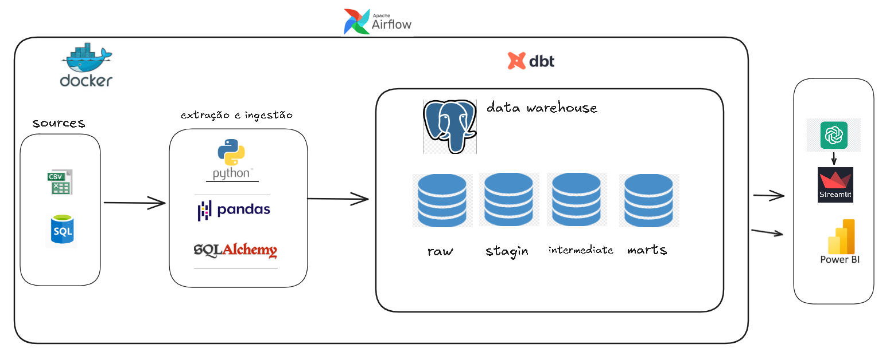

# Fluxo de Caixa

Projeto de engenharia de dados e analytics para estruturar o fluxo de caixa em uma base analítica confiável, com pipeline de ingestão, modelagem em dbt, orquestração com Airflow e uma camada de consulta em linguagem natural com FastAPI + Streamlit.

## Objetivo

Este projeto foi construído para transformar registros financeiros dispersos em um ambiente analítico centralizado, capaz de:

- consolidar entradas, saídas e saldos em uma única base;
- reduzir retrabalho manual e inconsistências;
- padronizar cálculos financeiros;
- apoiar a tomada de decisão com dados rastreáveis;
- habilitar consultas rápidas sobre o fluxo de caixa por meio de um assistente financeiro.

## Arquitetura



De forma geral, a solução está organizada assim:

1. ingestão de dados com Python;
2. armazenamento central em PostgreSQL;
3. transformação e modelagem com dbt;
4. orquestração com Apache Airflow;
5. consumo analítico em dashboards;
6. consulta em linguagem natural por meio de API FastAPI e frontend Streamlit.

## Estrutura do repositório

```text
backend/                API e assistente financeiro
src/                    pipeline de ingestão/carga
dags/                   DAG do Airflow
include/                funções auxiliares usadas pelo Airflow
dw_fluxo_caixa/         projeto dbt
``` 

## Como rodar

As instruções abaixo consideram o fluxo correto do projeto:

- `src/docker-compose.yml`: sobe PostgreSQL e pgAdmin;
- `astro dev start`: sobe o ambiente local do Airflow via Astro CLI.

### Pré-requisitos

- Python 3.12.4 recomendado
- Docker Desktop com Docker Compose
- Astro CLI instalada
- chave `API_KEY` da OpenAI para a camada de assistente

### 1. Instale as dependências Python

Git Bash:

```bash
python -m venv .venv
source .venv/Scripts/activate
pip install -r requirements.txt
```

### 2. Configure as variáveis de ambiente

Use os arquivos de exemplo como ponto de partida:

```powershell
Copy-Item .\env_example .\.env
Copy-Item .\src\envexample .\src\.env
```

Depois ajuste os valores para o seu ambiente. Os arquivos de exemplo usam placeholders, então não deixe credenciais reais nem valores específicos no repositório.

A raiz do projeto usa:

- `env_example` -> `.env`

A pasta `src` usa:

- `src/envexample` -> `src/.env`

### 3. Suba o PostgreSQL e o pgAdmin

Se a rede Docker `postgres_fluxo_network` ainda não existir, crie a rede docker rodando o comando: 

```bash
docker network create postgres_fluxo_network
```

Depois suba os serviços de banco:

```bash
docker compose -f src/docker-compose.yml up -d
```

### 4. Rode o Airflow via Astro

Com o banco em execução, suba o Airflow:

```bash
astro dev start
```

A interface do Airflow deve ficar disponível em:

- `http://localhost:8080`

### 5. Configure a conexão do Airflow

A DAG principal usa `BaseHook.get_connection("postgres_fluxo")`.

Confirme a conexão PostgreSQL no Airflow com os valores abaixo:

- Connection Id: `postgres_fluxo`
- Connection Type: `Postgres`
- Host: `fluxo_de_caixa`
- Port: `5432`
- Database: `fluxo_db`
- User: `seu user`
- Password: `seu password`

O arquivo `airflow_settings.yaml` já define essa conexão para o ambiente local do Astro.

### 6. Execute a DAG

A DAG principal está em [`dags/dag.py`](dags/dag.py) e executa:

1. a carga dos CSVs para o PostgreSQL;
2. `dbt seed`;
3. `dbt run`.

Depois de subir o Airflow, a DAG pode ser disparada pela interface web.

### 7. Rode a API localmente

Com o ambiente Python ativo e as variáveis configuradas, execute no Git Bash:

```bash
export PYTHONPATH=backend
uvicorn main:app --app-dir backend --reload
```

A API responde em:

```text
POST http://127.0.0.1:8000/perguntar
```

### 8. Rode o frontend Streamlit

Em outro terminal Git Bash:

```bash
streamlit run backend/app.py
```

## Ordem recomendada de execução

1. copie `env_example` para `.env`;
2. copie `src/envexample` para `src/.env`;
3. crie a rede Docker `postgres_fluxo_network`, se necessário;
4. suba PostgreSQL e pgAdmin com `docker compose -f src/docker-compose.yml up -d`;
5. suba o Airflow com `astro dev start`;
6. execute a DAG `dag_executar_pipeline`;
7. inicie a API FastAPI e o frontend Streamlit, se quiser usar o assistente.

## Fluxo de execução do projeto

1. os dados de origem são ingeridos por scripts Python;
2. a carga inicial popula tabelas brutas no PostgreSQL;
3. o dbt organiza os dados em camadas `raw`, `staging`, `intermediate` e `marts`;
4. o Airflow orquestra a sequência de execução;
5. os dados modelados alimentam análises financeiras e dashboards;
6. o assistente financeiro consulta os dados modelados para responder perguntas do usuário.

## Motivação do desenvolvimento

O projeto nasce de um problema comum em empresas: o controle de fluxo de caixa muitas vezes fica espalhado entre planilhas, relatórios manuais, ERPs e registros contábeis que não conversam entre si.

Isso gera efeitos diretos:

- consolidação manual de dados;
- maior risco de erro operacional;
- baixa confiabilidade para análises históricas;
- pouca previsibilidade financeira;
- muito tempo gasto para gerar relatórios.

A proposta desta solução é substituir esse processo fragmentado por uma arquitetura de dados que centraliza informações, padroniza regras de negócio e transforma movimentações financeiras em inteligência analítica.

## Assistente financeiro

O repositório também inclui uma camada de consulta em linguagem natural:

- a API em [`backend/main.py`](backend/main.py) recebe perguntas;
- o planner interpreta a intenção da pergunta;
- as métricas consultam o banco;
- o frontend em [`backend/app.py`](backend/app.py) exibe a resposta no Streamlit.

O assistente foi pensado para responder de forma determinística sobre métricas financeiras, reduzindo o risco de respostas sem fonte e aproximando a IA de um motor analítico guiado por regras.

## Stack utilizada

- Python
- PostgreSQL
- pgAdmin
- dbt
- Apache Airflow
- Docker
- FastAPI
- Streamlit
- OpenAI API

## Documentação

- [Documentação geral do projeto](especificacao_projeto/especificação do projeto - versão 2.docx)
